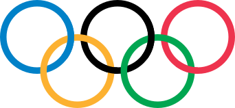

 &nbsp; &nbsp; &nbsp; &nbsp; &nbsp; &nbsp; &nbsp; &nbsp; &nbsp; &nbsp; &nbsp; &nbsp; &nbsp; &nbsp; &nbsp; &nbsp; &nbsp; &nbsp; &nbsp; &nbsp; &nbsp; &nbsp; &nbsp; &nbsp; &nbsp; &nbsp; &nbsp; &nbsp; &nbsp; &nbsp; &nbsp;
  

# Olympics Analysis

an exploration of Olympic medal performance using Python with Spark notebooks

This project uses Apache Spark in notebooks to conduct the analysis.  The datasets are actually quite small so it could be argued that Spark
is overkill for this situation.  But Spark is a fun environment to work with, and this small-scale example can illustrate how to solve similar problems
at a larger scale.
